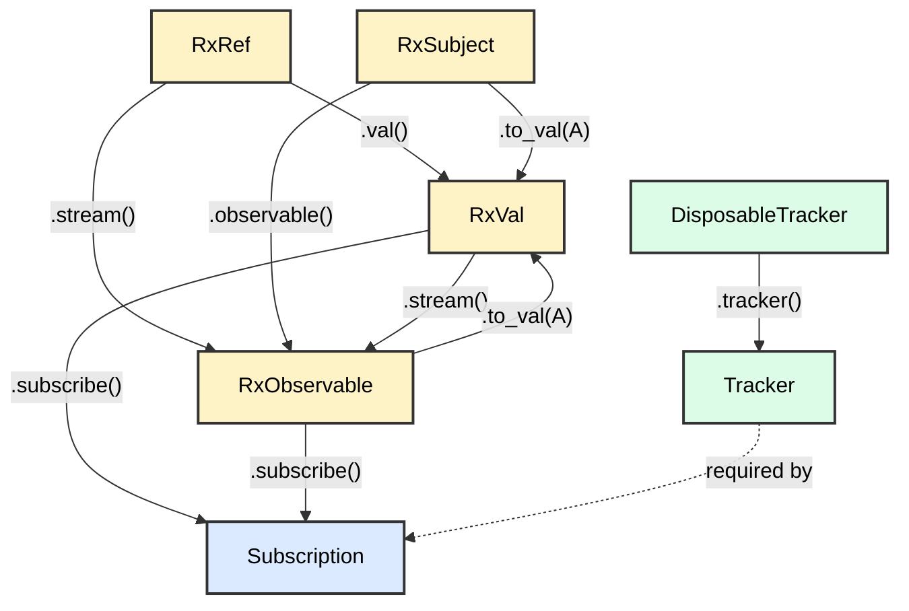

# rx-rs

[](https://crates.io/crates/rx-rs)

A lightweight single-threaded push-based reactive programming library for Rust.

## Architecture

### Core

| | Reactive Cell | Stream |
|---|---|---|
| **Read/Write** | `RxRef` | `RxSubject` |
| **Read** | `RxVal` | `RxObservable` |

#### Reactive Cell

Reactive cells hold a current value and notify subscribers when the value changes. They support deduplication, so subscribers only receive updates when the value actually changes. Subscriptions emit the current value immediately upon subscribing.

#### Stream

Streams are event-based observables that emit values over time without holding state. Unlike reactive cells, streams emit every event and don't deduplicate values. Subscriptions do not emit immediately and only receive values emitted after subscribing.

### Lifetimes

#### Subscription

A subscription is a way to listen to value changes from reactive cells or streams. Each subscription requires a tracker to manage its lifetime.

#### Disposable Tracker

A disposable tracker is the way to manage subscription lifetimes. It handles when all tracked subscriptions are disposed, either automatically when dropped or manually via `dispose()`.

#### Tracker

A tracker is a view of a disposable tracker that is required by subscriptions. It allows subscriptions to be tied to the parent disposable tracker's lifetime without direct access to disposal.

### Type Relationships



## Quick Start

```rust
use rx_rs::prelude::*;

fn main() {
    let dt = DisposableTracker::new();
    let tracker = dt.tracker();

    // Reactive value with current state
    let counter = RxRef::new(0);

    counter.val().subscribe(tracker, |value| {
        println!("Counter: {}", value);
    });

    counter.set(1); // Prints: Counter: 1
    counter.set(2); // Prints: Counter: 2
}
```

## Installation

Add this to your `Cargo.toml`:

```toml
[dependencies]
rx-rs = "0.1.3"
```

## License

Licensed under either of:

- Apache License, Version 2.0 ([LICENSE-APACHE](LICENSE-APACHE))
- MIT license ([LICENSE-MIT](LICENSE-MIT))

at your option.
